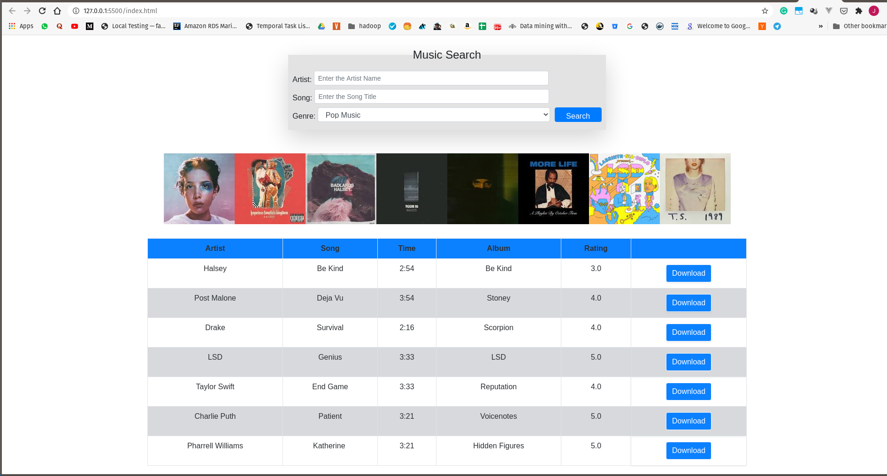

# gbc-finalAssignment-fullstack1


# Details


## Student details
Student name - **Jalmeen Kaur Sehti**
Enrollment Number - **101290765**
*Individual Project*


## Output
 
```

```

## Technology stack / tools used 

Following tools were used to complete this assignment:

|            SNo    |Tech                          |
|----------------|-------------------------------|
|1|`'BootStrap'`            |
|2         |`"HTML"`            |
|3         |`CSS`|
|4         |`Git Version Control`|
|5       |`GitHub Private Repo`|
|6       |`Netlify for Hosting `|


